## LHSK 


##### Team LHSK 입니다.
----------
<u><b>react 및 스프링 버전 정보 기입 필요</b></u>

npm version etc icon으로 세팅 예정

## 프로젝트 세팅


* #### Remote Info - origin: https://github.com/LHSK0107/demo-repository.git
  
     1. git clone 또는 git pull을 통해 원격 저장소로부터 가져오기
  1. 로컬 저장소에서 작업 요소에 따른 브랜치 생성 후, 작업 진행
  1. 작업 완료 후, main 브랜치에 merge하기 위한 PR 요청
  1. Code Review 후, merge assign
  1. 완료 후, issue close 및 프로젝트 내 항목 이동


----------
## 작업 방식 및 정보
  ### Remote Info
  - origin: [LHSK repository](testing)

### Branch Info

  * main 브랜치를 주축으로 각 요소 별 branch를 생성 후, 작업
    - ex) feature/login, feature/header 등 feature/[branch name]으로 부여
    
    - 생성은 git branch 'feature/[branch name]'
    
    - 생성 후, 브랜치 변경은 git checkout 'feature/[branch name]'
    
    - ```tex
      $ git branch feature/header
      $ git checkout feature/header
      Switched to branch 'feature/footer'
      $ git branch -a
      * feature/footer
        main
        remotes/origin/feature/amazing
        remotes/origin/feature/header
        remotes/origin/main
      ```
    
    - <b>작업에 앞서 브랜치 위치 파악 중요</b>
    
    - 정상적으로 Switched된 경우라도 git branch -a를 통해 현재 어느 브랜치가 선택되어 있는지 확인 후에 작업

### Commit

  * Commit 분류는 간단하게 다음과 같이 구성하며, 추가로 필요한 경우 규칙 생성 (Initial 등)
    - [UPDATE] : 코드 수정 및 변경
    - [STYLE] : 디자인, 애니메이션 관련 변경 사항
    - [ADD] : 신규 파일 추가
    - [FIX] : 잘못된 정보 변경, 문제 수정
    - [DELETE] : 파일 삭제

### PR 요청

#### (1) 최초 브랜치 push 경우

  * 작업 후, 해당 브랜치로 원격 저장소에 push

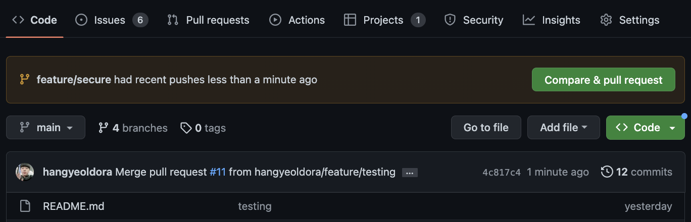

  * Compare & pull request 버튼 클릭 후, write에서 마크다운 형식으로 코멘트를 작성 ( 프리뷰에서 확인 가능)

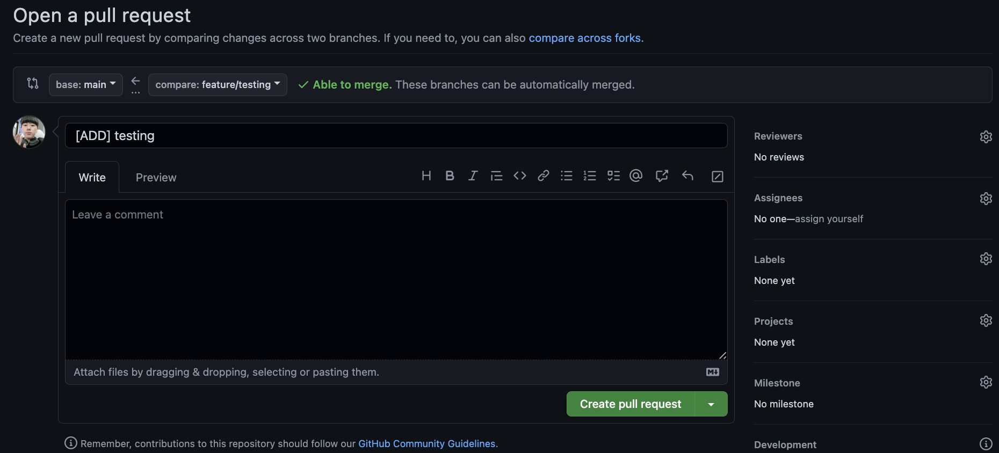

  * 각 옵션에서 Reviewers를 눌려서 review를 요청할 사람 선택
  * pull request를 수락해줄 Assignees 사람 선택
  * Labels에서는 해당 pr이 이슈를 해결한 것인지, 새로 진행한 것인지 각 작업에 맞는 라벨을 선택하여 클릭
  * 프로젝트에서는 내역에서 LHSK에 맞는 프로젝트 선택

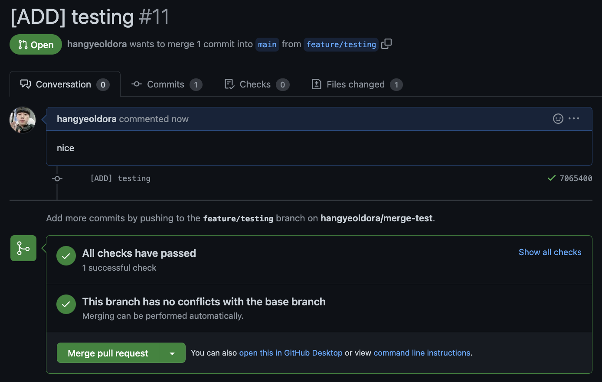

  * 정상적으로 세팅 후, create pull request를 하면 open 문구 나옴
  * 그 후, 프로젝트에 들어가면 Choose Columns에 PR한 내역이 나오게 됨

#### (2) 원격 저장소에 브랜치가 존재할 경우

- 이미 브랜치가 존재하는 경우에는 자동으로 pull request 요청이 이루어지지 않음
- 그래서 github 탭의 Pull requests로 들어가서 직접 생성을 해야 함

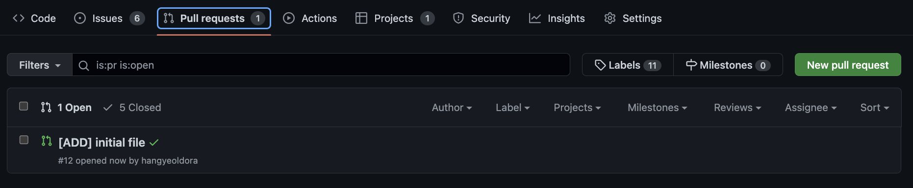

- 이후는 (1)의 과정과 같이 동일하게 진행

### PR 생성 후, review & assign pull request

- PR에서 어떤 요소가 변경되었는지 Commits, Files changed 등 항목에서 확인

[변경 전]

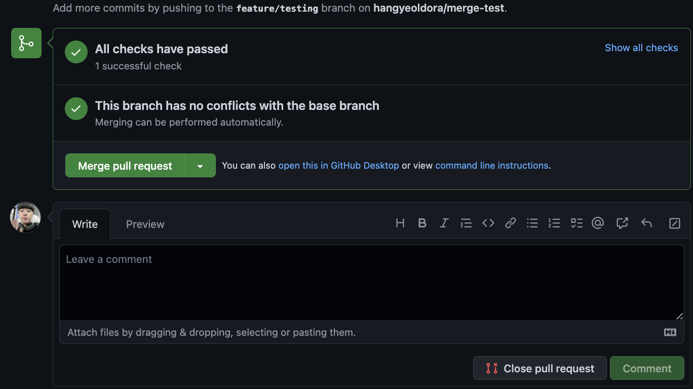

[변경 후]

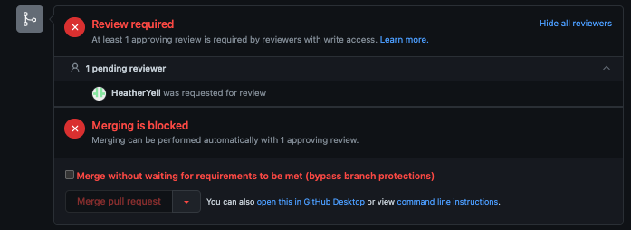

- 리뷰가 필요한 경우, 아래 comment쪽에서 서로 진행하도록 정했으나, 최소 한 명 이상의 팀원이 리뷰를 하도록 지정
- Comment 등 작성 후, 이상 요소가 없다면 merge
- 이 외에도 rebase 등이 가능하나 상황에 맞춰서 진행

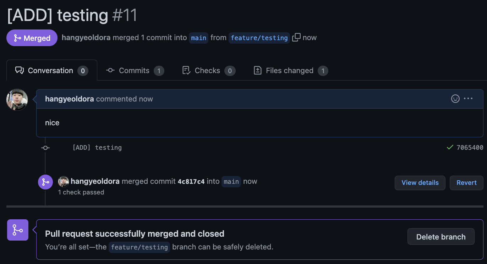

- Merge를 confirm하면 open에서 merged라고 변경됨

### Issue 생성 (수정 중)

- 어떤 부분이 작동하지 않거나 충돌 등의 에러가 발생한 경우뿐만 아니라 meeting 등 각종 이벤트에 대해서 추가 및 선택
- 타이틀은 '[이슈 요소 #number] text'로 진행 => 이슈, PR은 생성 후에도 프로젝트 작업 등에서 타이틀 수정이 가능 (Issue, Todo, PR 등)

### Project -Workflows

- 프로젝트명은 '<u>Webcash Project Board'</u>
- 프로젝트는 LHSK 조직에 들어가서 상단탭에서 'projects'를 클릭하거나 'integrated-banking-system' 레포지토리에 접속하여 상단 탭에서 Projects를 선택

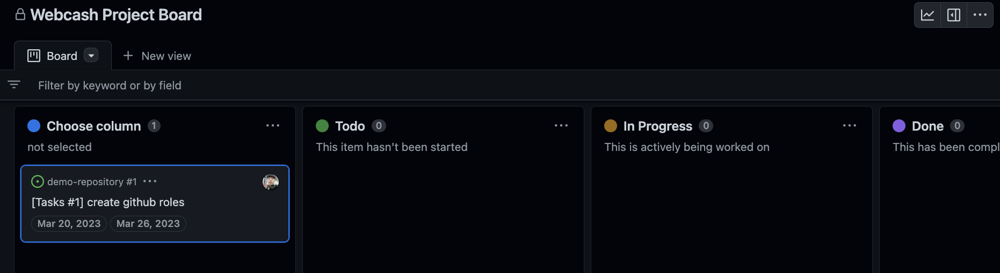

- issue를 생성하고 Pull Request를 요청할 경우, Choose column 컬럼으로 아이템이 자동으로 추가가 되니, 항목에 맞는 컬럼으로 이동 필요
- Pull Request에 대한 Review가 이루어졌을 경우, Reviewed 항목으로 자동 추가
- Pull Request가 assign되었을 경우, Done 항목으로 자동 추가

### Project - Roadmap

#### (1) Roadmap

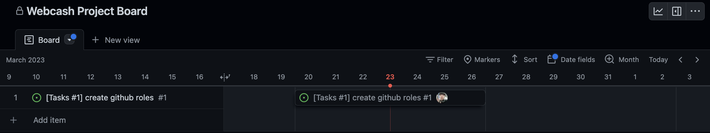

- Webcash Project Board 제목 바로 밑에 있는 탭 'board' 옆의 화살표를 클릭하면, Layout 3가지를 볼 수 있으며, 일정은 Board와 Roadmap에서 확인 가능

### (2) 이슈 및 작업에 일정 등록하기

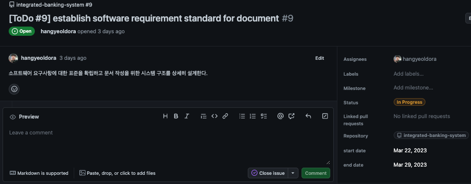

-  일정에 등록하려는 항목을 클릭하면 우측 옵션 항목에서 아까 생성한 항목들을 볼 수 있으며, 'Enter a date'를 클릭하여 날짜 설정이 가능 
-  설정 후에는 우측 상단의 'X'를 클릭

#### (3) 일정 등록을 위한 Date Field 생성 (참고 사항)

*이미 등록되어 있는 start, end 필드 사용

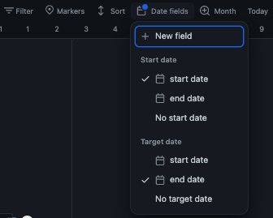

- 일정을 등록하기 위해서는 캘린더 우측 상단에 있는 Date fields에서 필드 생성을 해야 하는데, State와 End 날짜에 해당하는 필드를 각각 설정해줘야 함

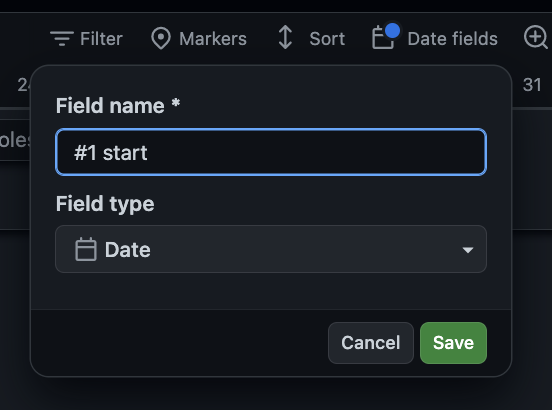

- Filed name으로 start #'num', end #'num' 로 필드를 생성 ex) #1 start 등 예제에서는 start 'write srs document'

### 